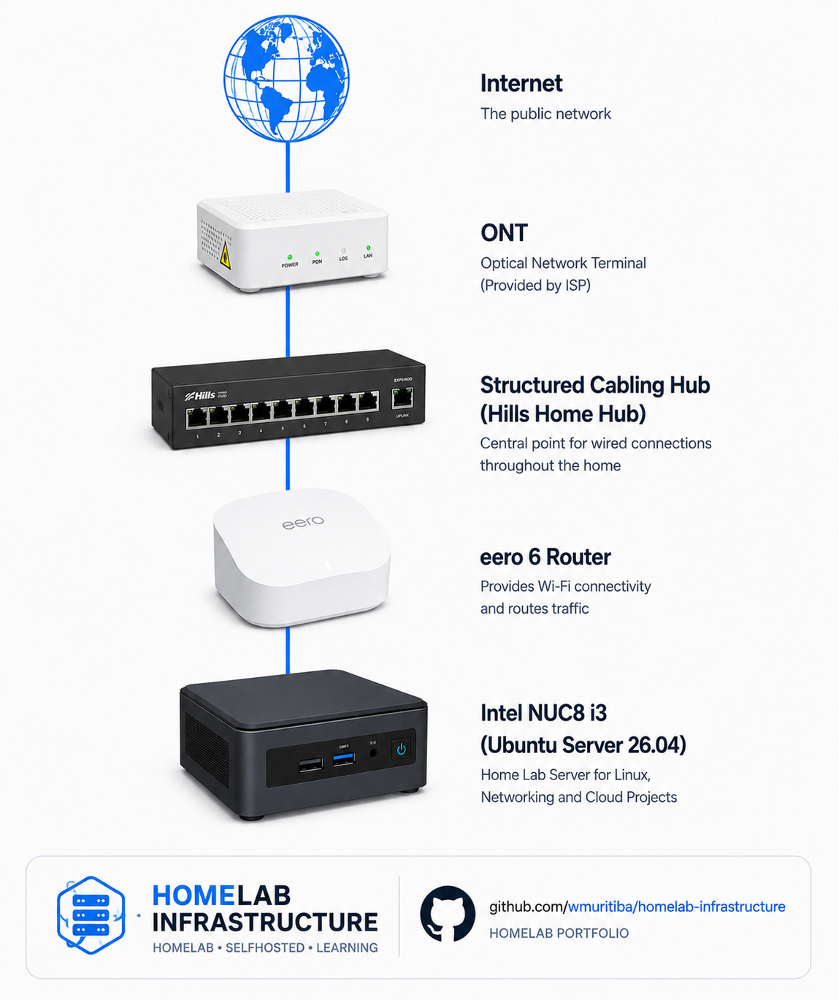

# Home Lab Infrastructure

A hands-on home lab project designed to develop practical skills in Linux administration, networking, monitoring and cloud infrastructure.

## Current Architecture

  

<i>Figure 1 – Initial Home Lab network topology.</i>

## Objectives

- Linux Administration
- Networking Fundamentals
- Infrastructure Monitoring
- Cloud Technologies
- Automation

## Current Environment

### Hardware

- Intel NUC8i3BEK

### Operating System

- Ubuntu Server 26.04 LTS

## Current Services

- [ ] SSH
- [ ] UFW Firewall
- [ ] Docker
- [ ] Portainer

## Planned Services

- [ ] Pi-hole
- [ ] Uptime Kuma
- [ ] Grafana
- [ ] WireGuard

## Documentation

- [Project Overview](docs/01-project-overview.md)
- [Hardware Inventory](docs/02-hardware.md)
- [Ubuntu Server Installation](docs/03-installation.md)
- Network Configuration *(coming soon)*
- Security *(coming soon)*
- Services *(coming soon)*
- Monitoring *(coming soon)*
- Troubleshooting *(coming soon)*

## Learning Journey

This repository documents the design, deployment and administration of a home lab environment built to strengthen skills relevant to Cloud Support, Infrastructure Support and Networking roles.
