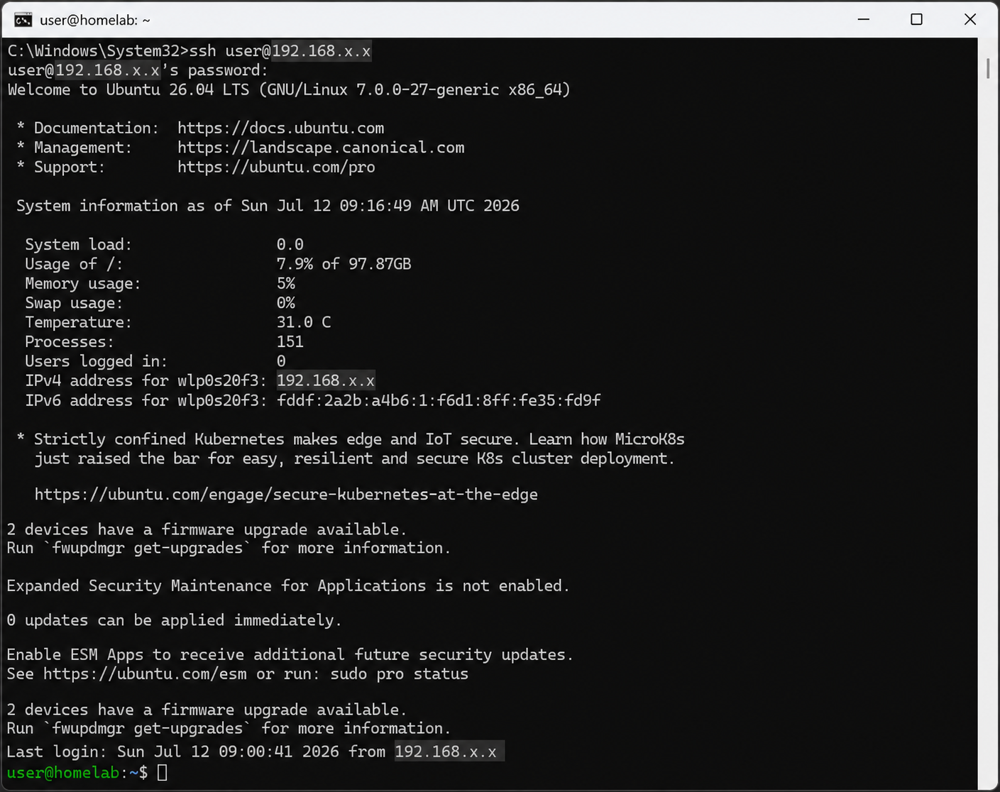
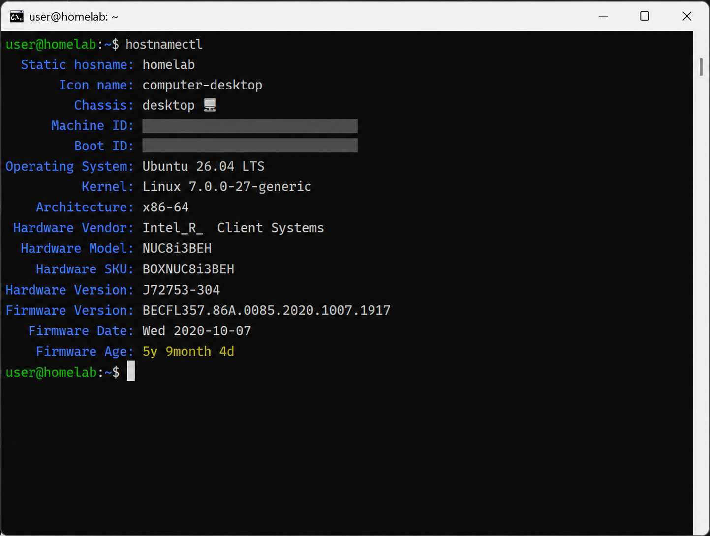
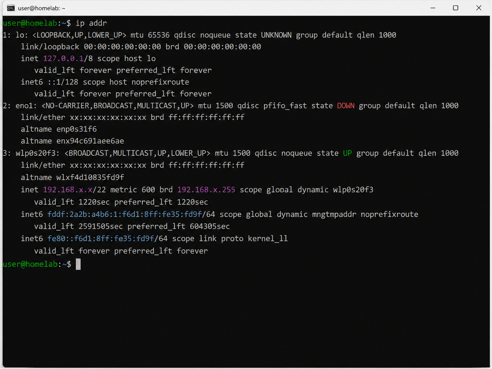
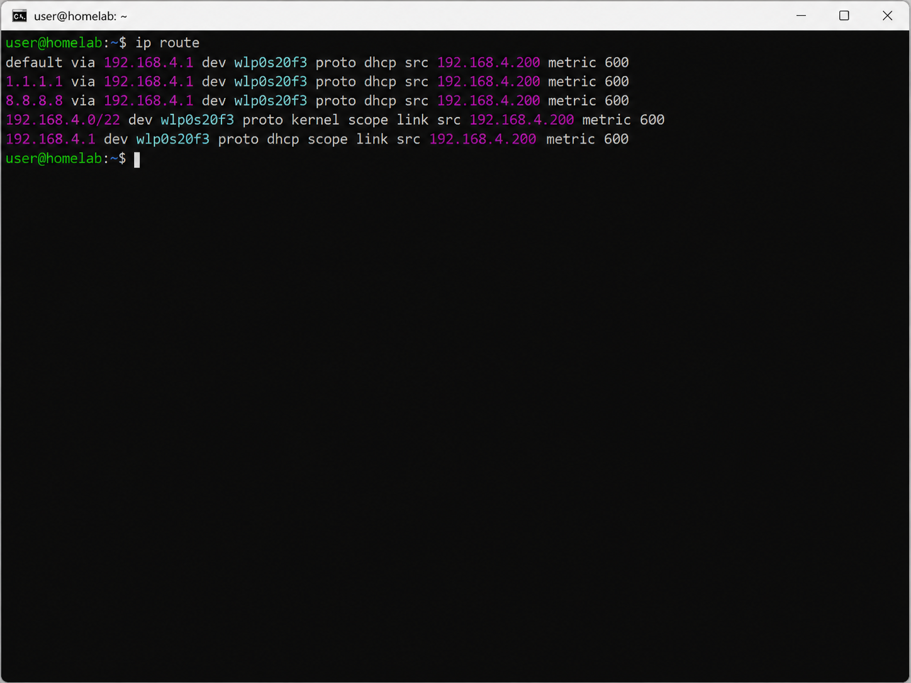
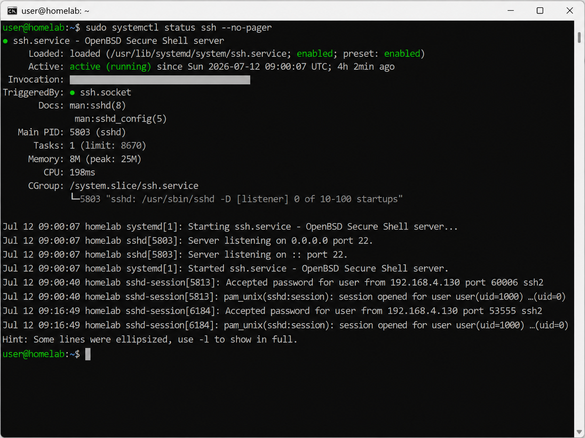

# SSH Service

## Overview

SSH (Secure Shell) provides secure remote administration for the Home Lab server, allowing management from an authorized workstation without requiring physical access.

---

## Objective

Provide secure remote administration for the Ubuntu Server.

---

## Environment

| Component | Details |
|-----------|---------|
| Server | Intel NUC8i3BEH |
| Operating System | Ubuntu Server 26.04 LTS |
| Client | Windows 11 |
| SSH Client | OpenSSH |

---

## Implementation

### Install OpenSSH Server

```bash
sudo apt update
sudo apt install openssh-server
```

Enable the service:

```bash
sudo systemctl enable ssh
sudo systemctl start ssh
```

---

## Validation

Remote administration was successfully validated from a Windows workstation using the OpenSSH client.

### SSH Login

<p align="center">
  
</p>

<p align="center">
  <em>Figure 1 — Successful SSH connection from a Windows workstation.</em>
</p>

---
### System Information

<p align="center">
  
</p>

<p align="center">
  <em>Figure 2 — Ubuntu Server system information and hardware details.</em>
</p>

### Network Interfaces

The network interfaces were verified after the SSH deployment to confirm the server connectivity and identify the active network adapter.

The server is currently connected through the wireless interface (`wlp0s20f3`), while the onboard Ethernet interface (`eno1`) is available for future infrastructure expansion.

<p align="center">
  
</p>

<p align="center">
  <em>Figure 3 — Network interfaces identified after the initial server deployment.</em>
</p>

### Routing Table

The routing table was verified to confirm that the server received a valid default gateway and that network traffic was correctly routed through the active network interface.

The validation confirmed:

- A default route was successfully configured.
- Network routes were assigned through DHCP.
- The active interface (`wlp0s20f3`) was correctly selected.
- Local subnet routing was successfully established.

<p align="center">
  
</p>

<p align="center">
  <em>Figure 4 — Routing table validation after the initial Ubuntu Server deployment.</em>
</p>

### SSH Service Status

The OpenSSH service status was verified after the initial server deployment to confirm that the SSH daemon was successfully enabled and is operating correctly.

The validation confirmed:

- The OpenSSH service is loaded.
- The service is enabled to start automatically during system boot.
- The SSH service is running and accepting remote connectionsg.
- The server is listening for incoming SSH connections on the default port.
- Remote administration is fully operational.

<p align="center">
  
</p>

<p align="center">
  <em>Figure 5 — OpenSSH service status after enabling the service for automatic startup.</em>
</p>

## Configuration

| Setting | Value |
|---------|-------|
| Port | 22 |
| Authentication | Password |
| Service | Enabled |
| Startup | Automatic |

---

## Security

Current implementation:

- Password authentication enabled
- Default SSH port (22)

Future improvements:

- SSH key authentication
- Disable password authentication
- Disable root login
- Fail2Ban
- UFW firewall rules

---

## Troubleshooting

### Issue

Unable to authenticate during the first remote login.

### Investigation

- SSH service was reachable.
- Network connectivity verified.
- Authentication prompt displayed correctly.

### Resolution

Recovered the correct credentials and successfully authenticated.

---

## Lessons Learned

- Always validate SSH immediately after installing the operating system.
- Store credentials securely in a password manager.
- Verify connectivity before assuming the SSH service is unavailable.
